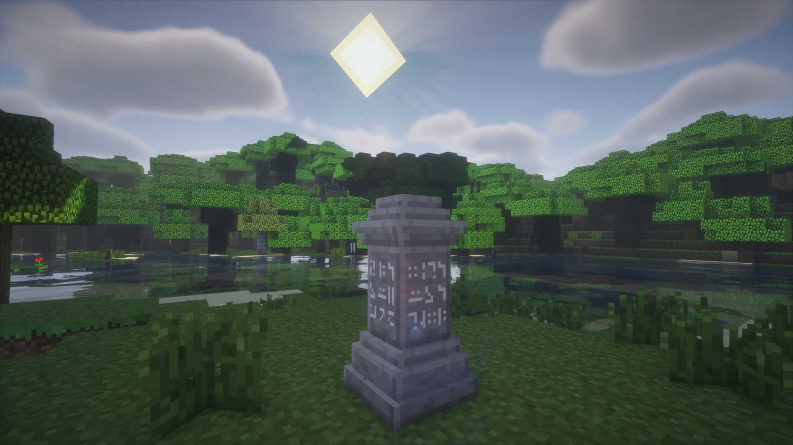
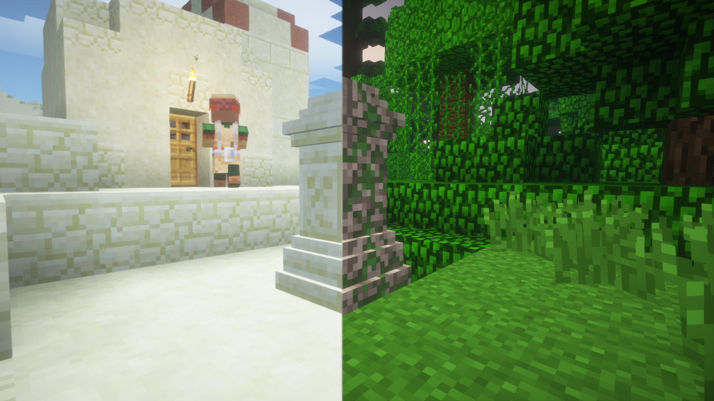
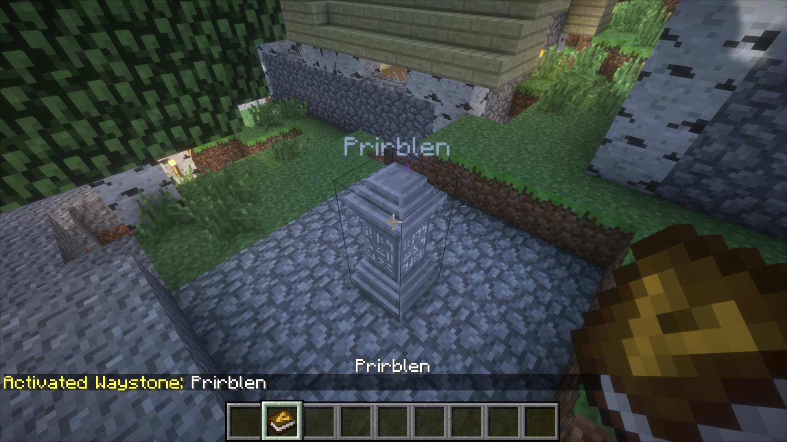
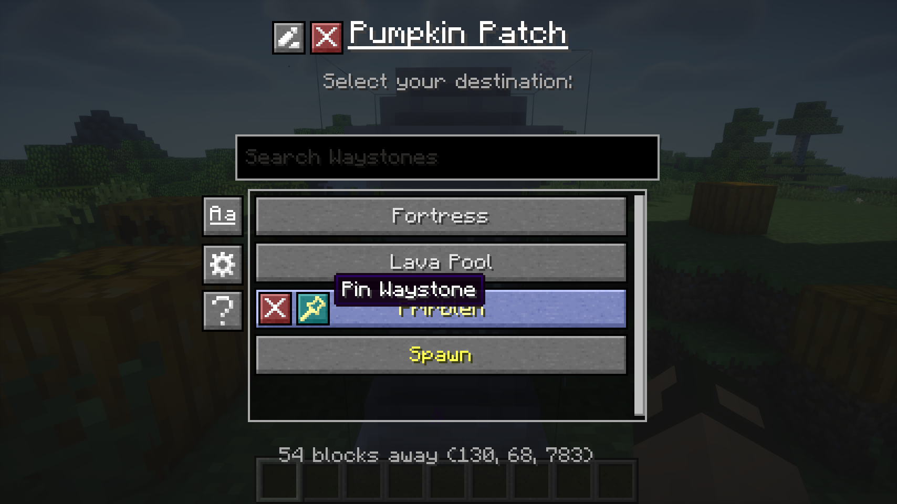
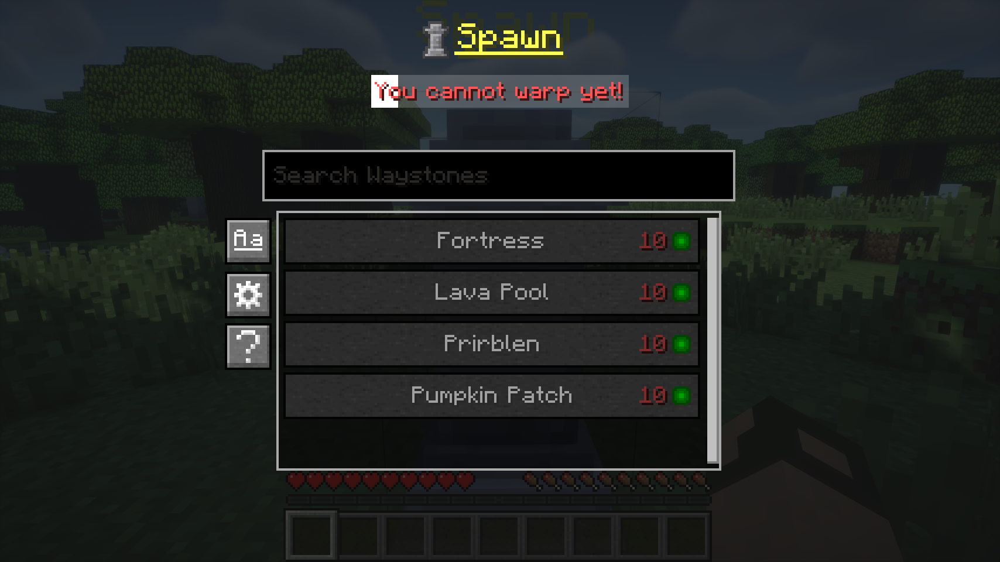

# Waystones-X (Unofficial Waystones Fork)

Teleport back to activated waystones. For Survival, Adventure or Servers.
([Waystones](https://github.com/TwelveIterations/Waystones) mod fork.)

### Fixes:
* Nether portals aren't generated when teleporting to the Nether (@kuzuanpa)
* Fixed some rendering bugs (@kuzuanpa)

### New features:
* New textures by DarkBum.
* Clicking an activated Waystone will open the teleport menu, instead of needing to shift-click it (much more intuitive)
* If configured, Waystones show nametags with their name.
* Duplicate Waystone names are disallowed.
* If a player exits the Waystone creation menu without properly naming it, the creation/naming menu will be shown upon next interaction (instead of creating an empty-named Waystone).
* GUI Configuration.
* Configurable worldgen.
* Automatic activation upon naming.
* Configurable [Village Names](https://modrinth.com/mod/village-names) mod compatibility.
* Configurable teleportation XP level cost. Flat cost, distance cost, flat cross-dim cost.
* Configurable global teleportation cooldown. Cooldown status indicator.
* Waystone list sorting by Name and Distance.
* Waystone list filtering.
* "Undiscovering/Forgetting" Waystones.
* Waystone renaming.
* Pinned Waystones which appear at the top of the list.
* Global Waystones are stored in the save NBT, no more conflicts.
* Sandstone, Mossy, (Mossy) Stonebrick, Netherbrick, Endstone Waystone variants.

### Worldgen configuration system:
You can define a list of rules under the `structureWaystoneRules` key in the config. Each rule can have the following properties:
* `structure`: Vanilla or modded structure id this rule applies to (for example village, temple_desert).
* `chance`: Spawn probability from `0` to `1` (`0` = never, `1` = always).
* `type`: Waystone variant override: `auto`, `stone`, `sandy`, or `mossy`. `auto` keeps structure/default logic.
* `name`: Optional fixed name override. If duplicates exist, a number suffix is appended automatically. Makes the most sense for unique structures.
* `forceGlobal`: `true`/`false`. If `true`, the Waystone is forced to become global. Requires name to be set.
* `autoActivateGlobal`: `true`/`false`. Only relevant when `forceGlobal=true`. `true` immediately registers as global, false waits until player activation.
* `dimensionWhitelist`: Allowed dimension IDs, comma-separated (for example `0,-1,1`) or `*` for all.
* `biomeWhitelist`: Allowed biome IDs, comma-separated (for example `2,17,21`) or `*` for all.

Example: `structure=village;chance=0.35;type=auto;dimensionWhitelist=0;biomeWhitelist=2,17,35`

Currently supported `structure` ids:
* `village`
* `temple_desert`
* `temple_jungle`
* `stronghold`
* `fortress`
* `end_spike`
* `world_spawn`

## Dependencies
* [UniMixins](https://modrinth.com/mod/unimixins)    

## Building

`./gradlew build`.

## Credits
* BlayTheNinth for the original mod.
* New textures by DarkBum.
* kuzuanpa for some bugfixes.
* Textures and ideas from [BetterWaystonesMenu](https://github.com/Loxoz/BetterWaystonesMenu/tree/1.18.2).
* brandyyn for some fixes.
* Omgise for Chinese translation.
* [GT:NH buildscript](https://github.com/GTNewHorizons/ExampleMod1.7.10).

## License

This project is a fork of [Waystones](https://github.com/TwelveIterations/Waystones/tree/1.7.10) by BlayTheNinth.

- **Original Waystones code**: [MIT License](LICENSE-MIT) (Copyright 2016 BlayTheNinth) ([archive](https://archive.md/IolUS))
- **New contributions**: [LGPLv3 + SNEED](LICENSE) (Copyright 2025 jack)

The combined work is distributed under LGPLv3 + SNEED terms. The original MIT-licensed portions remain available under MIT terms.

## Buy me a coffee

* [ko-fi.com](ko-fi.com/jackisasubtlejoke)
* Monero: `893tQ56jWt7czBsqAGPq8J5BDnYVCg2tvKpvwTcMY1LS79iDabopdxoUzNLEZtRTH4ewAcKLJ4DM4V41fvrJGHgeKArxwmJ`

 

