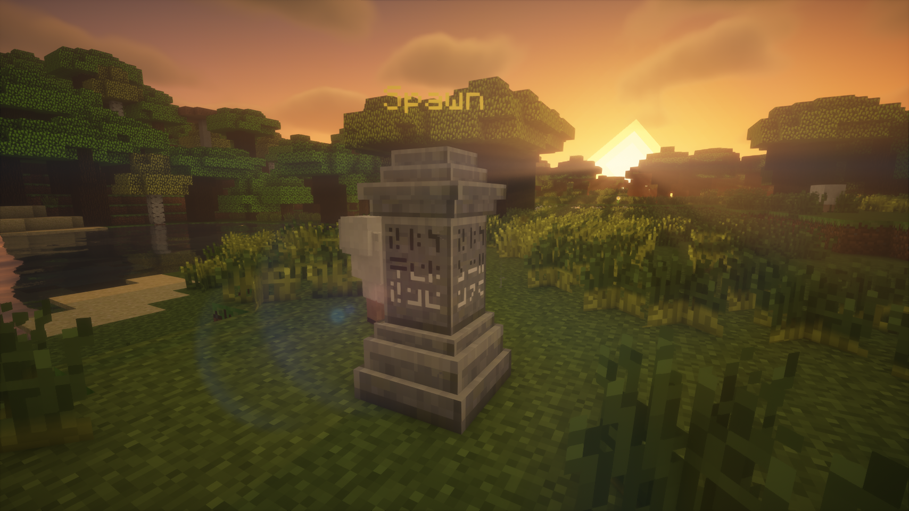
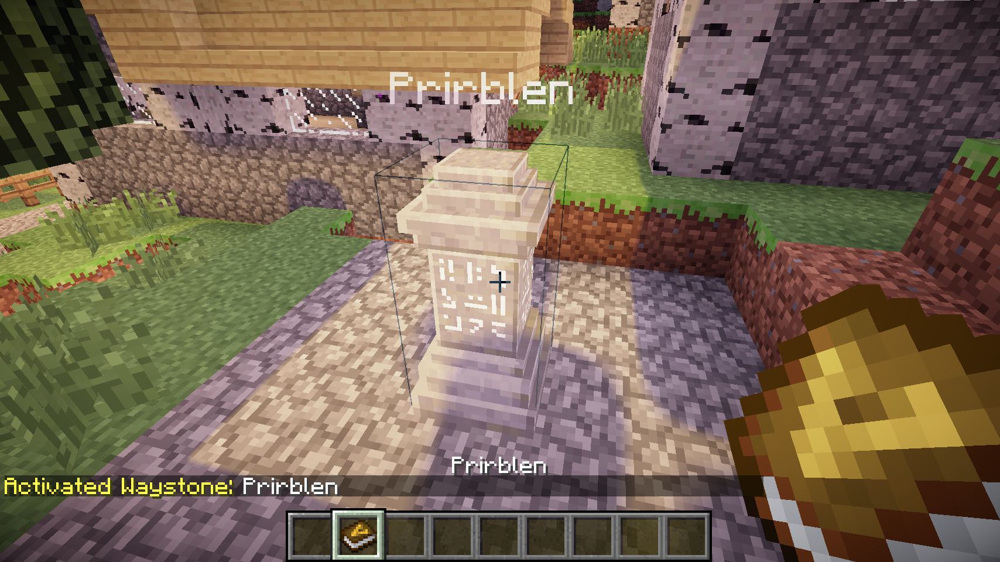
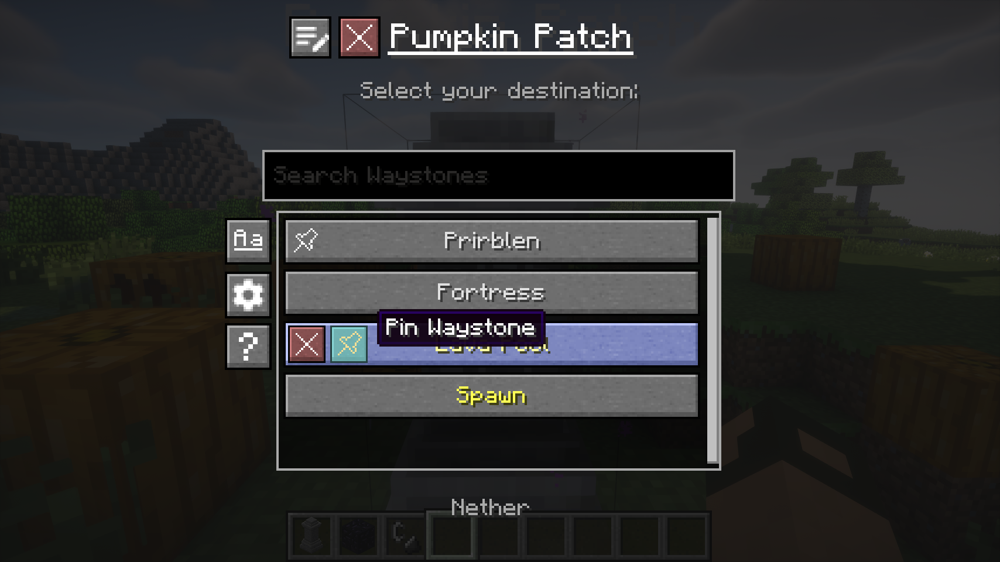
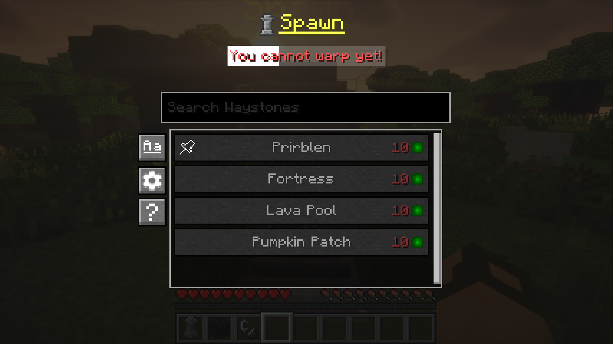

# Waystones-X (Unofficial Waystones Fork)
Teleport back to activated waystones. For Survival, Adventure or Servers.
([Waystones](https://github.com/TwelveIterations/Waystones) mod fork.)

<!---->

### Fixes:
* Nether portals aren't generated when teleporting to the Nether (@kuzuanpa)
* Fixed some rendering bugs (@kuzuanpa)

### New features:
* Clicking an activated Waystone will open the teleport menu, instead of needing to shift-click it (much more intuitive)
* If configured, Waystones show nametags with their name.
* Duplicate Waystone names are disallowed.
* If a player exits the Waystone creation menu without properly naming it, the creation/naming menu will be shown upon next interaction (instead of creating an empty-named Waystone).
* GUI Configuration.
* Configurable worldgen inside of Villages.
* Automatic activation upon naming.
* Configurable [Village Names](https://modrinth.com/mod/village-names) mod compatibility.
* Configurable teleportation XP level cost. Flat cost, distance cost, flat cross-dim cost.
* Configurable global teleportation cooldown. Cooldown status indicator.
* Waystone list sorting by Name and Distance.
* Waystone list filtering.
* "Undiscovering/Forgetting" Waystones.
* Waystone renaming.
* Pinned Waystones which appear at the top of the list.
* Global Waystones are stored in the save NBT, no more conflicts.

## Dependencies
* [UniMixins](https://modrinth.com/mod/unimixins)    

## Building

`./gradlew build`.

## Credits
* BlayTheNinth for the original mod.
* kuzuanpa for some bugfixes.
* Textures and ideas from [BetterWaystonesMenu](https://github.com/Loxoz/BetterWaystonesMenu/tree/1.18.2).
* brandyyn for some fixes.
* Omgise for Chinese translation.
* [GT:NH buildscript](https://github.com/GTNewHorizons/ExampleMod1.7.10).

## License

This project is a fork of [Waystones](https://github.com/TwelveIterations/Waystones/tree/1.7.10) by BlayTheNinth.

- **Original Waystones code**: [MIT License](LICENSE-MIT) (Copyright 2016 BlayTheNinth) ([archive](https://archive.md/IolUS))
- **New contributions**: [LGPLv3 + SNEED](LICENSE) (Copyright 2025 jack)

The combined work is distributed under LGPLv3 + SNEED terms. The original MIT-licensed portions remain available under MIT terms.

## Buy me a coffee

* [ko-fi.com](ko-fi.com/jackisasubtlejoke)
* Monero: `893tQ56jWt7czBsqAGPq8J5BDnYVCg2tvKpvwTcMY1LS79iDabopdxoUzNLEZtRTH4ewAcKLJ4DM4V41fvrJGHgeKArxwmJ`

 

